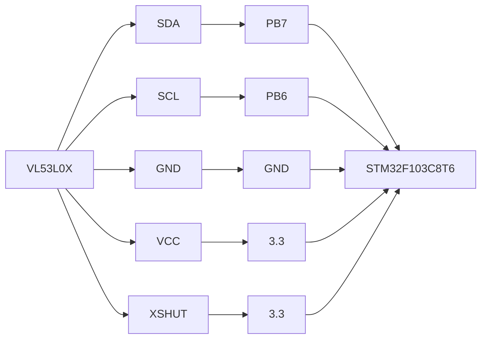

# TesteV3l0x

Um firmware paracontrolar os sensores VL53L0X com um STM32f103c8t6

# Recomendações  

O projeto é simples, porém usa o STM32103f103c8, o que significa:

  
- Linux facilita o processo, mas é possivel fazer com Windows;
- VSCode;
- Extensão do Vscode Platformio;
- Upload do código via STLink;
- Debug via PIO + STLink;

# Setando o ambiente

Seguem os passos necessários para o ambiente de desenvolvimento e testes do projeto

## Passo 1

Baixe o .deb [VSCode](https://code.visualstudio.com/download) e em seguida o instale com os comandos abaixo;

    cd Dowloads
    sudo dpkg -i code_algo.deb

Agora procure pela extensão platformio

## Passo 2

Sete as udev rules com o comando abaixo:

    curl -fsSL https://raw.githubusercontent.com/platformio/platformio-core/develop/platformio/assets/system/99-platformio-udev.rules | sudo tee /etc/udev/rules.d/99-platformio-udev.rules

Em seguida reinicie a ferramenta de gerenciamento udev:

    sudo  service  udev  restart

## Passo 3
Instale o stlink-tools para fazer upload do booloader do STM32:
`
sudo apt-get update &&
sudo apt-get install stlink-tools
`

## Passo 4
Faça a clone do projeto e o abra no VSCode

## Passo 5
O ambiente já deve estar pronto para uso, utilize a aba de debug para testar o projeto, ou apenas faça upload.

- 1: Variaveis do sistema;
- 2: Variáveis escolhidas para monitorar;
- 3: Ponto de interrupção;
- 4: Controle de runtime do sistema;

Como podemos ver na parte a direita o PIO Debug funciona muito bem para monitorar as varieveis do programa, então seu uso é extremamente recomendado.

